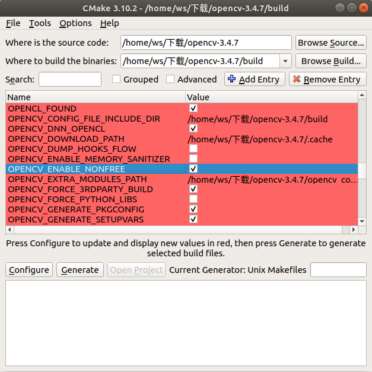

# OpenCV与Contrib安装

### 1 下载OpenCV源码以及对应版本的contrib源码:

https://opencv.org/

https://github.com/opencv/opencv_contrib

### 2 :解压源码

将OpenCV源码解压,contrib解压到OpenCV文件夹下,在源码目录下新建文件夹,命名为build,如果build文件夹里有上次编译生成的文件需要清空了,否则编译会报错


### 3 安装图形化cmake以及OpenCV的依赖

OpenCV依赖环境安装参照<<编译安装OpenCV>>,图形界面cmake安装方式如下:

```shell
sudo apt install cmake-gui
```

### 4 使用cmake-gui配置编译参数

选择源码目录,以及build目录,然后点击configure,之后勾选nonfree



勾选c++11


EXTRA_MODULES_PARTH选择contrib文件夹下moudles


再次configure,如果CMake没有红色部分就generate

### 5 编译安装

进入build目录下,打开终端,输入

```shell
make -j8
```

等待编译结束后安装

```shell
sudo make install
```

