# shell编程

## 一 变量

### 1 变量的定义与使用

```shell
#!/bin/bash
#第一行不可省略
num1=1
num2=2
str1=qwfp
#变量赋值等号两侧不能有空格
echo "str1="$str1
echo "num1="$num1
echo "num2="$num2
echo "变量连接""$str1$str1"
echo "变量默认都是字符串$num1+$num2"
echo "若想实现数学运算用小括号括起来$(($num1+$num2))"
```

### 2 位置参数变量

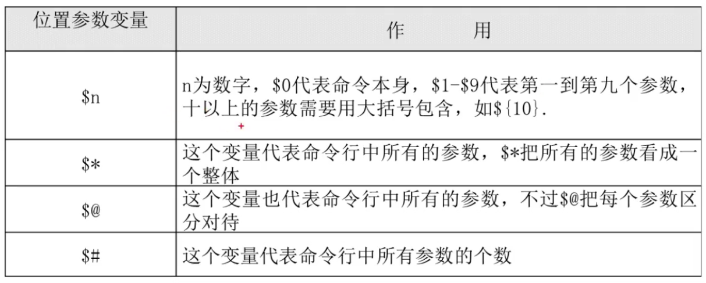

```shell
#!/bin/bash
echo $#
echo $@
echo $*
for s in $@
	do
		echo $s
	done
```

### 3 预定义变量

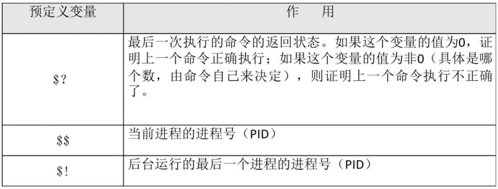

```shell
#!/bin/bash
ls
echo $?
arstarst
echo $?
echo $$
echo $!
```

### 4 read接受键盘输入 

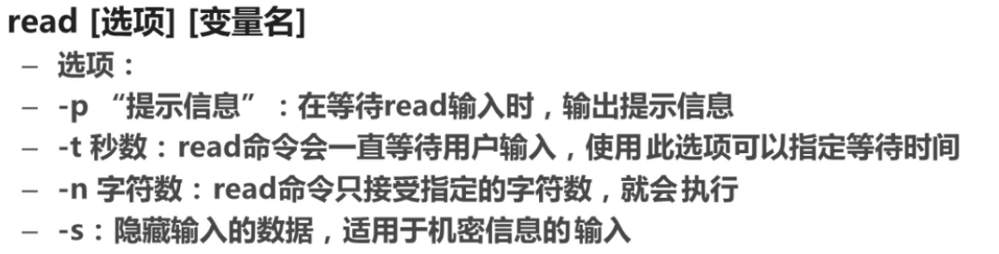

```shell
#!/bin/bash
read -p "请输入你的名字" name
echo "你的名字是$name"
```


## 二 运算

### 1 declare命令

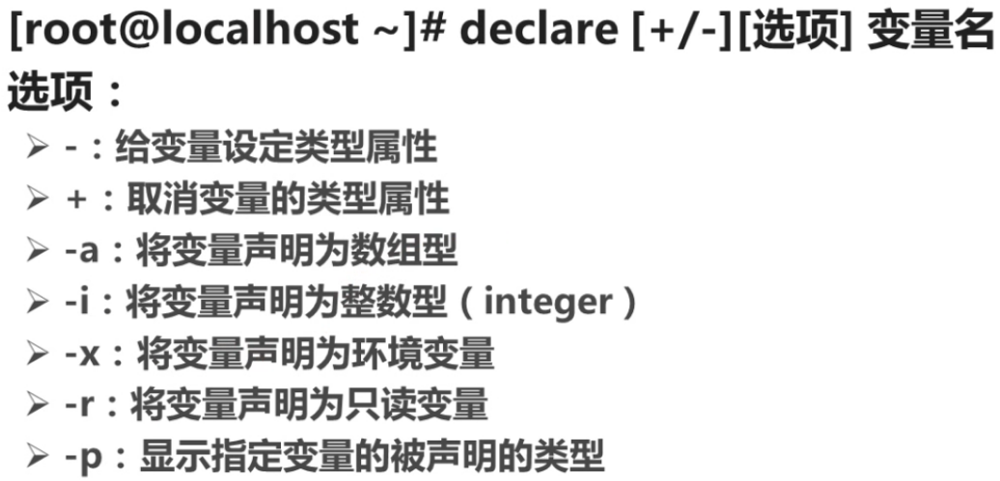

```shell
a=11
b=22
declare -i c = $a+$2
```

### 2 数值运算方式

#### 2.1数组

``` shell
#!/bin/bash
movie[0]=cl
movie[1]=tpc
declare -a movie[2]=tpb
echo ${movie[*]}
echo ${movie[1]}
echo ${movie}
```

#### 2.2 数值运算

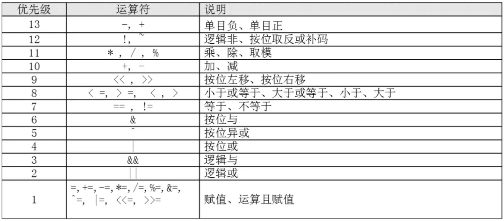

```shell
#!/bin/bash
aa=11
bb=22
dd=$(expr $aa + $bb)
echo $dd
ee=$(($aa+$bb))
echo $ee
ff=$[$aa+$bb]
echo $ff
```

#### 2.3 变量置换

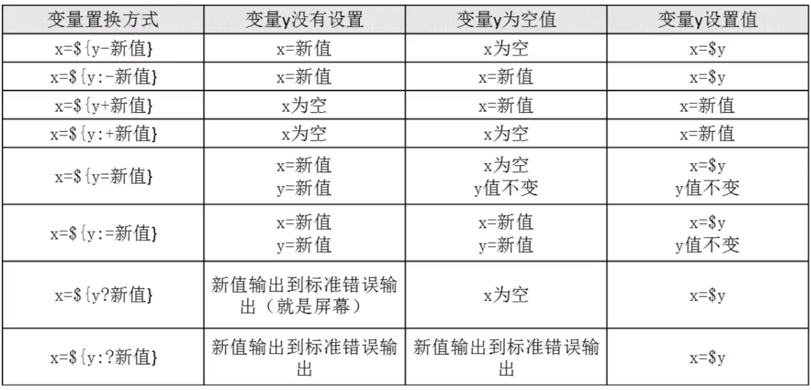

## 三 条件判断语句

### 1 文件类型判断


```shell
#!/bin/bash
[ -e ./test.sh ] && echo yes || echo no
```

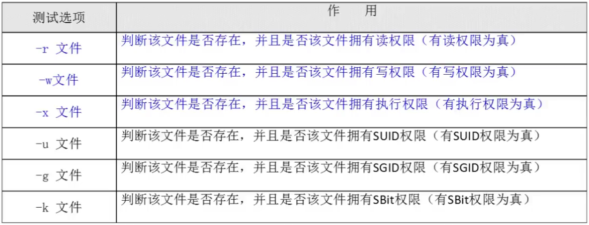

```shell
#!/bin/bash
[ -w ./test.sh ] && echo yes || echo no
```

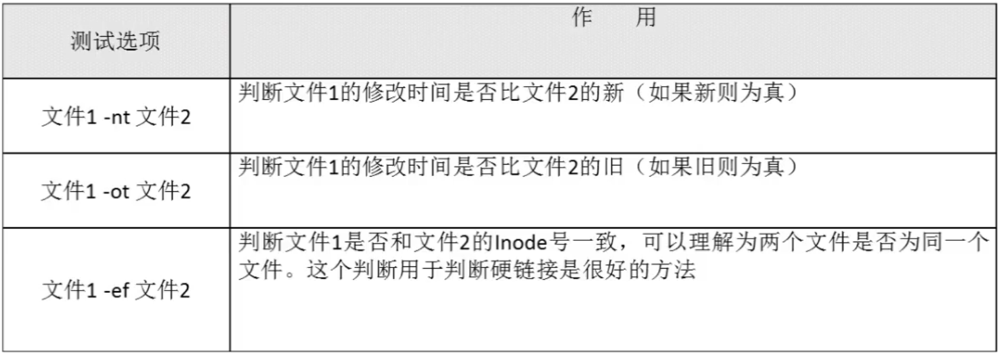

```shell
#!/bin/bash
ln ./test.sh ./test
[./test.sh -ef ./test] && echo yes || echo no
```

### 2 数值判断

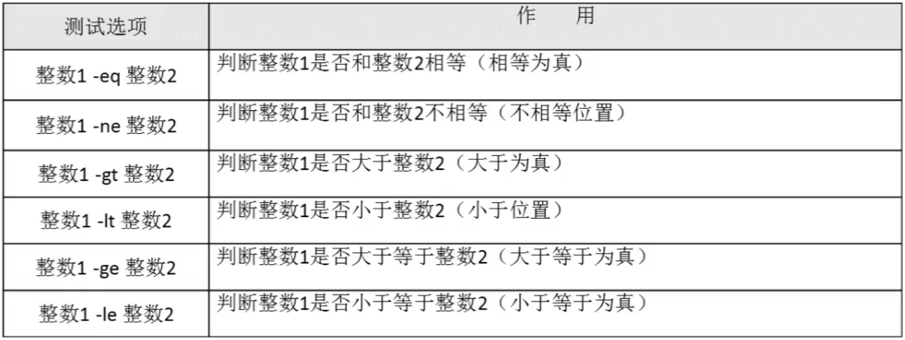

```shell
#!/bin/bash
[ 22 -ge 21 ] && echo yes || echo no
```

### 3 字符串判断

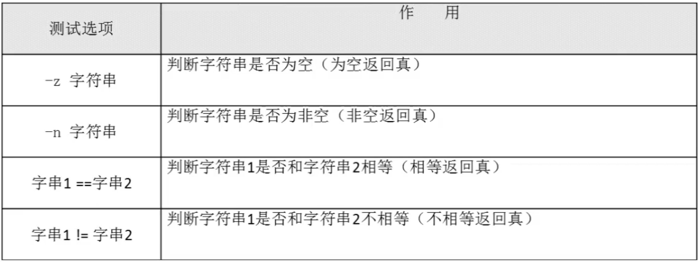

```shell
#!/bin/bash
name=fengjie
[ -z $name ] && echo yes || echo no
[ 22 == 21 ] && echo yes || echo no
```

### 4 多重条件判断

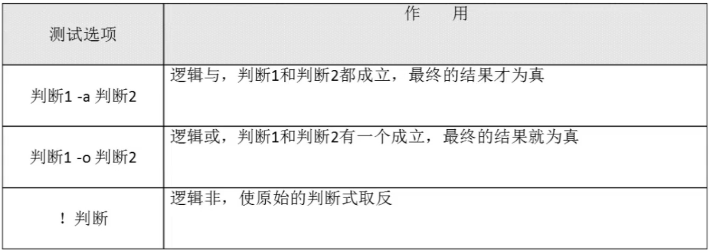

```shell
#!/bin/bash
aa=11
[ -n "$aa" -a "$aa" -gt 22 ] && echo yes || echo no
```

### 5 流程控制

#### 5.1 if

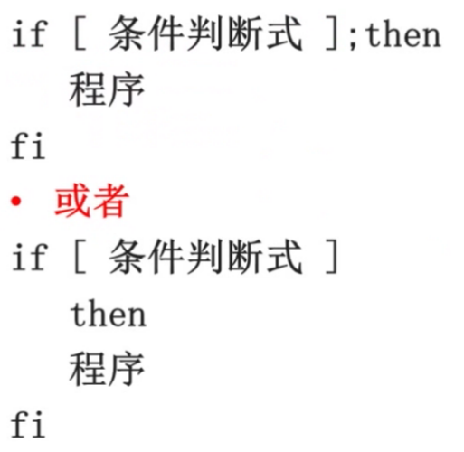

```shell
#!/bin/bash
test=$(env | grep USER | cut -d "=" -f 2)
if [ "$test"=="ws" ]
        then
                echo "Current user is ws"
fi

useage=$(df -h|grep sda7|awk '{print $5}'|cut -d "%" -f 1)
if [ $useage -ge 90 ]
        then
                echo "Warning! /home part is full! "$useage"%"
fi
useage=$(df -h|grep sda8|awk '{print $5}'|cut -d "%" -f 1)
if [ $useage -ge 90 ]
        then
                echo "Warning! / part is full! "$useage"%"
fi
```


```shell
#!/bin/bash
read -p "请输入一个目录 " dir
if [ -d $dir ]
	then
		echo "$dir is a dir"
	else
		echo "$dir is not a dir"
fi
```

 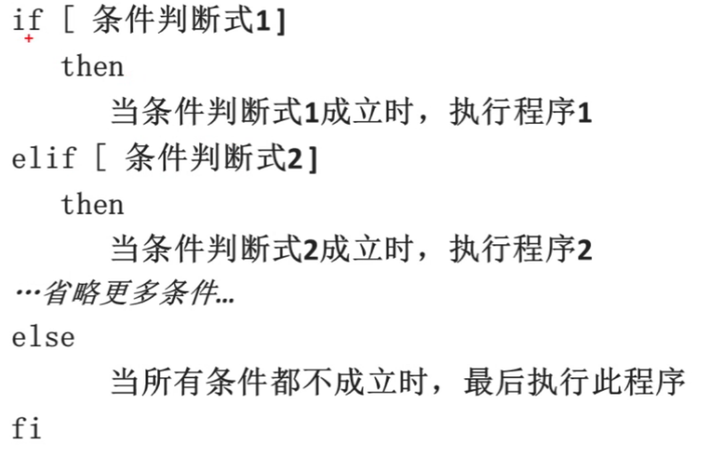