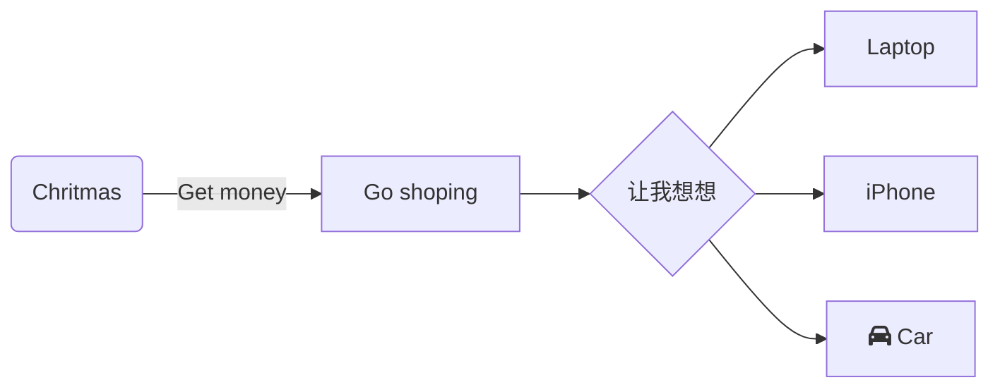

# typora 使用笔记
## 1. 安装
官方网站 https://www.typora.io
## 2. markdown 语法演示
# 一级标题
## 二级标题
### 三级标题
#### 四级标题
#####　五级标题
###### 六级标题
**加粗**
*斜体*
<u>下划线</u>
~~删除线~~
`行内代码块`
[超链接](https://ｗww.baidu.com)

[卯点](#一级标题)

| 序号 | 地点 | 时间 |
| ---- | ---- | ---- |
| １   | 天津 | １９：２０ |
| ２   | 北京 | １１：０５ |

> 引用


```python
#代码块
print('hello world')
```

- 001
  - 002
    - 003
- 1. tt
  2. tt
  3. ff
- [ ] 任务列表
- [x] 任务列表
上标、下标[^1]

[^1]: 来自这里(https://www.bilibili.com/video/av20190823?from=search&seid=429901743835642891)
上标：x^2^
下标：H~2~O
==高亮==
<!--注释-->
内联公式
$e^x+1=0$
分割线

---
emoji
:arrow_up:
mermaid

