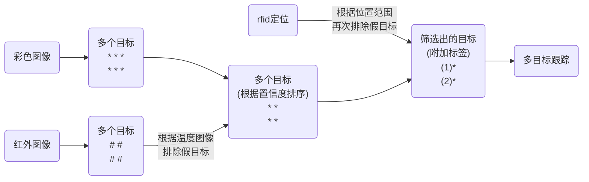

#　项目流程图

```mermaid
graph LR;
a(彩色图像)-->b(多个目标<br>*  *  *<br>*  *  *)
c(红外图像)-->d(多个目标<br>#  #<br>#  #)
b-->e("多个目标<br>(根据置信度排序)<br>*  *<br>*  *")
d--"根据温度图像<br>排除假目标"-->e
f(rfid定位)--"根据位置范围<br>再次排除假目标"-->g("筛选出的目标<br>(附加标签)<br>(1)*<br>(2)*")
e-->g
g-->h(多目标跟踪)
```

